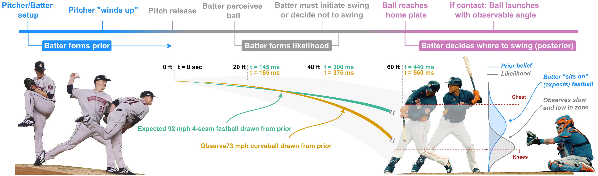

# Bayesball: Bayesian Integration in Professional Baseball Batting

This is the repo for the paper, [Bayesball: Bayesian Integration in Professional Baseball Batting](). 

<p align="center">
   
<p>
  

The repo is structured as follows:

```bash
.
├── main.ipynb               # Main notebook for running data analysis and generating figure parts
├── data                     # Raw and cleaned data
├── env                      # Environment files
├── img                      # Images used in some of the figures
├── figures    
│    ├── figure_parts           # Where main.ipynb saves parts of figures 1-4 (all svg)
│    │         ├── figure 1
│    │         ├── ...
│    └──  vector_files          # SVG files for completed figures
└── lib                         # All .py files called in main.ipynb
```

Everything can be run from the `main.ipynb` notebook. Please reach out with any issues or comments. 
